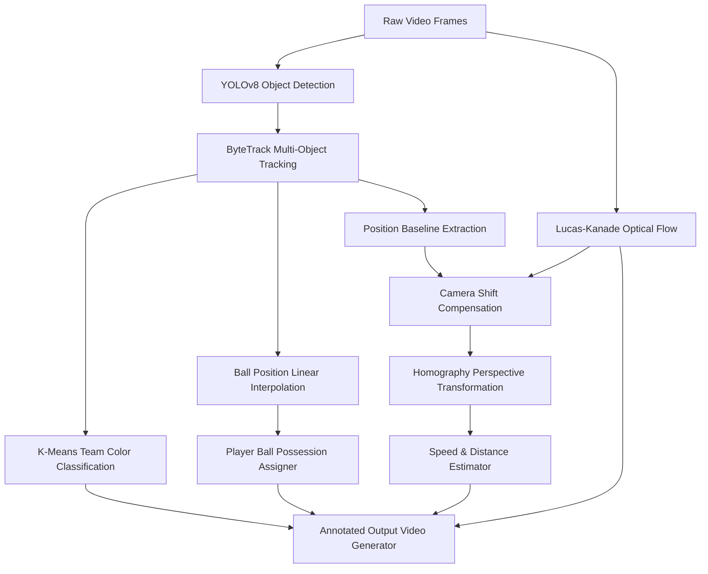

# ⚽ AI-Powered Football Match Analytics & Player Tracking System

[](https://www.python.org/)
[](https://github.com/ultralytics/ultralytics)
[](https://opencv.org/)
[](https://pytorch.org/)
[](LICENSE)

An end-to-end Computer Vision and Spatial Data Analytics pipeline that detects, tracks, and analyzes football players, referees, and the ball in broadcast footage in real time. 

By combining **deep learning object detection (YOLOv8)**, **multi-object tracking (ByteTrack)**, **K-Means jersey color clustering**, **Lucas-Kanade optical flow camera movement estimation**, and **homography perspective transformation**, this system maps 2D camera pixels into real-world pitch coordinates to measure player speed, total distance run, and team possession statistics.

---

## 📌 Project Demo


---

## 🔥 Key Technical Features

### 1. Custom Object Detection & ByteTrack Multi-Object Tracking
* Fine-tuned **YOLOv8** model trained to accurately detect **players**, **referees**, and the **football** under varying lighting and camera angles.
* Integrated **ByteTrack** via Supervision for persistent ID tracking across object occlusions and fast motion.

### 2. K-Means Jersey Color Classification
* Performs automatic team assignment without requiring manual labeling.
* Crops player bounding boxes, extracts jersey regions, and applies **K-Means Clustering** in OpenCV color space to isolate primary kit colors and dynamically classify players into Team 1 vs. Team 2.

### 3. Ball Possession & Acquisition Assignment
* Calculates Euclidean distance between the football and player bounding box baselines frame-by-frame.
* Dynamically attributes ball control to the closest player within a dynamic threshold and aggregates cumulative **Team Possession Statistics** overlayed on-screen.

### 4. Lucas-Kanade Optical Flow Camera Compensation
* Addresses camera panning, tilting, and zooming by tracking background feature points (`cv2.goodFeaturesToTrack`) across frame pairs using the **Lucas-Kanade Optical Flow** algorithm (`calcOpticalFlowPyrLK`).
* Subtracts background camera vector shifts from raw pixel coordinates to ensure true player position tracking.

### 5. Perspective Transformation (2D Pixel to 3D Pitch Mapping)
* Computes a **Homography Matrix** (`cv2.getPerspectiveTransform`) using standard pitch reference vertices.
* Maps distorted broadcast perspective coordinates into flat metric pitch dimensions ($68\text{m} \times 23.32\text{m}$ tactical view).

### 6. Physical Metrics: Speed & Distance Estimation
* Tracks player movement in physical meters over sliding frame windows.
* Calculates instantaneous speed ($\text{km/h}$) and total distance covered ($\text{m}$) throughout the match duration.

---

## 📐 Mathematics & CV Pipeline Architecture



---

## 🛠️ Tech Stack & Dependencies

* **Language**: Python 3.10+
* **Deep Learning Framework**: PyTorch, Ultralytics YOLOv8
* **Computer Vision**: OpenCV (`cv2`), Supervision
* **Machine Learning & Analytics**: Scikit-Learn (K-Means), NumPy, Pandas
* **Tracking & Optical Flow**: ByteTrack, Lucas-Kanade Pyramid Optical Flow

---

## 📂 Repository Structure

```
football-analysis/
│-- camera_movement_estimator/     # Optical flow camera shift calculation & overlay
│-- development_and_analysis/       # Jupyter notebooks for model prototyping & color tuning
│-- models/                        # Fine-tuned YOLOv8 model weights (best.pt)
│-- player_ball_assigner/          # Distance-based ball possession assignment logic
│-- speed_and_distance_estimator/  # Metrics computation (speed in km/h, distance in m)
│-- stubs/                         # Cached tracking & camera movement data for fast dev iterations
│-- team_assigner/                 # K-Means color clustering for kit identification
│-- trackers/                      # Object tracking pipeline & visualization utilities
│-- utils/                         # Bounding box geometry, video IO, & math helpers
│-- view_transformer/              # Perspective transform mapping pixels to real-world meters
│-- main.py                        # Central execution script & pipeline coordinator
│-- requirements.txt               # Project dependencies
```

---

## 🚀 Getting Started

### 1. Prerequisites
Ensure you have **Python 3.10+** and `pip` installed. Using a virtual environment is strongly recommended.

```bash
# Clone the repository
git clone https://github.com/your-username/football-analysis.git
cd football-analysis

# Create and activate virtual environment
python -m venv venv
# On Windows:
venv\Scripts\activate
# On Linux/macOS:
source venv/bin/activate
```

### 2. Install Dependencies
```bash
pip install -r requirements.txt
```

### 3. Place Model Weights & Input Video
- Ensure your trained YOLOv8 model weight `best.pt` is located in `models/best.pt`.
- Place your input match video in `input_videos/` (e.g., `input_videos/08fd33_4.mp4`).

---

## 💻 Running the Analysis

Execute the main pipeline script:

```bash
python main.py
```

The output video with all tracking ellipses, team possession overlays, optical flow indicators, and player speed/distance stats will be saved to:
`output_videos/output_video.mp4`

> **Note on Stubs**: To accelerate development, tracking predictions and camera movement vectors can be cached to `.pkl` stub files in `stubs/`. Set `read_from_stub=False` in `main.py` when analyzing a new video clip.

---

## 📈 Future Enhancements

- [ ] **Offside Line Detection**: Automated offside determination using field perspective lines.
- [ ] **Heatmaps & Pass Networks**: Tactical heatmaps and player interaction networks.
- [ ] **Multi-Camera Stitching**: Seamless tracking across multiple stadium broadcast angles.

---

* LinkedIn: https://www.linkedin.com/in/aliba7/

---
*If you find this repository useful, please consider giving it a ⭐!*
